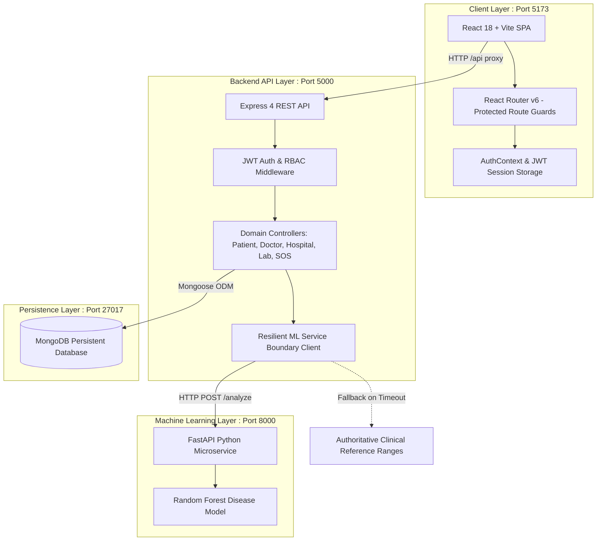

# Med-X

Med-X is a unified, full-stack healthcare platform that integrates four core clinical and administrative healthcare domains—**Patients**, **Doctors**, **Hospital Administrators**, and **Diagnostic Laboratories**—into a single monorepo. The platform unifies electronic medical records, biomarker tracking, machine learning-driven physiological risk scoring, outpatient triage, inpatient bed and capacity management, and emergency response.

---

## Overview

In traditional healthcare infrastructure, clinical records, patient-facing portals, hospital management systems, and diagnostic laboratory systems exist as isolated silos. Med-X bridges these fragmented systems into a synchronized, role-based architecture:

- **Patients** access their longitudinal diagnostic history, track physiological biomarkers, run AI What-If simulations, and trigger emergency SOS assistance.
- **Doctors** evaluate consultation triage queues, review diagnostic laboratory reports, issue prescriptions, record clinical notes, and dispatch emergency responses.
- **Hospital Administrators** oversee hospital operations, monitor bed and ICU occupancy in real time, manage a 6-stage patient care queue, and manage physician departments.
- **Laboratory Administrators** ingest and parse laboratory test results, compare values against established reference ranges, and digitally finalize reports for physician review.

---

## Key Capabilities

- **Longitudinal Biomarker Tracking & Analytics**: Visual tracking of core physiological biomarkers (Fasting Glucose, Hemoglobin, White Blood Cells, Serum Creatinine, Platelet Count) across historical diagnostic observations with interactive Recharts visualizations.
- **Machine Learning Clinical Risk Assessment**: A dedicated Random Forest microservice evaluates multi-organ disease risk vectors (Diabetes, Anemia, Kidney Strain, Infection, Cardiovascular) and computes a composite clinical risk score and risk tier.
- **Automated Diagnostic Lab Report Ingestion**: Ingests clinical lab reports via structured manual parameter entry or PDF document parsing with automated biomarker extraction.
- **Outpatient Consultation & Dossier Review**: Physicians review pending diagnostic reports, annotate clinical findings, issue prescriptions, and record patient follow-ups.
- **Inpatient Bed & ICU Operations Matrix**: Hospital administrators manage live bed occupancy, assign admitted patients to designated units, and track critical capacity across general wards and ICUs.
- **6-Stage Care Queue Triage Pipeline**: Structured operational task progression (`TRIAGE`, `ADMISSION`, `CONSULTATION`, `LAB_TESTING`, `PROCEDURE`, `DISCHARGE`) synchronized to patient records.
- **Cross-Role Emergency SOS Lifecycle**: Real-time emergency alert dispatch system allowing patients to broadcast emergency signals with location metadata, which doctors and hospital desks can acknowledge, dispatch ambulances to, and resolve.
- **Multi-Tenant Role-Based Access Control (RBAC)**: Centralized authentication and authorization with strict tenancy isolation and IDOR protection across roles.
- **Safe Account Management**: Self-service profile management and two-step verified account deactivation.

---

## User Roles

| Role | System Role Key | Primary Responsibilities & Permissions |
| :--- | :--- | :--- |
| **Patient** | `patient` | Access personal health records, upload lab reports (PDF/manual), view longitudinal biomarker trends, run What-If simulations, trigger emergency SOS, and manage personal profile. |
| **Doctor** | `doctor` | Access attending physician workstation, manage assigned patient roster, conduct clinical reviews on diagnostic reports, write prescriptions and clinical notes, and dispatch emergency alerts. |
| **Hospital Administrator** | `hospital_admin` | Monitor facility dashboard, manage ward and ICU bed allocations, coordinate the 6-stage operational Care Queue, view admitted patients, and resolve emergency incidents. |
| **Laboratory Administrator** | `lab_admin` | Manage diagnostic pathology laboratory operations, draft and parameterize laboratory test reports, compare values against clinical reference ranges, and finalize verified reports. |

---

## System Architecture

Med-X is organized as an ES Module monorepo consisting of a React single-page application (SPA), an Express API backend, a persistent MongoDB database, and an autonomous FastAPI machine learning service.



### Architectural Highlights
- **Resilient ML Boundary**: The Node.js backend communicates with the FastAPI service via HTTP (`POST /analyze`). If the ML microservice is unreachable or times out, the backend automatically falls back to an authoritative clinical reference range algorithm, preventing disruption to report processing.
- **Strict Database Persistence**: The backend mandates a persistent MongoDB database at runtime. Mock and in-memory databases are strictly restricted to isolated automated testing.
- **Unified Identity Model**: A single canonical `User` identity maps 1-to-1 with role-specific profiles (`Patient`, `Doctor`, `Hospital`, `Lab`), enforcing secure foreign key relationships across medical reports, prescriptions, and alerts.

---

## Technology Stack

| Layer / Component | Technology | Version | Purpose |
| :--- | :--- | :--- | :--- |
| **Frontend Framework** | React | 18.3.1 | Core UI component library |
| **Frontend Routing** | React Router DOM | ^6.28.0 | Client-side routing & protected role guards |
| **Frontend Build Tool** | Vite | ^6.0.0 (v6.4.3) | High-performance bundling and development server |
| **Charts & Visualizations**| Recharts | ^2.12.7 | Longitudinal spline trends and radar vulnerability maps |
| **UI Icons** | Lucide React | ^0.468.0 | Consistent iconography |
| **HTTP Client** | Axios | ^1.7.9 | Frontend and backend HTTP communication |
| **Backend Runtime** | Node.js (ES Modules) | >= 18.0.0 | Server-side JavaScript runtime |
| **Backend Framework** | Express | ^4.21.2 | REST API routing and middleware pipeline |
| **Database ODM** | Mongoose | ^8.10.1 | MongoDB object modeling and schema validation |
| **Database Engine** | MongoDB | >= 6.0 | Primary persistent document database |
| **Authentication** | jsonwebtoken | ^9.0.2 | Stateless JWT token issuance and verification |
| **Password Hashing** | bcryptjs | ^2.4.3 | Secure salted password hashing |
| **File Processing** | Multer & pdf-parse | ^1.4.5 / ^1.1.1 | PDF report upload and text extraction |
| **ML Framework** | FastAPI & Uvicorn | >= 0.100.0 / >= 0.22.0 | High-performance Python microservice |
| **Machine Learning** | Scikit-learn, NumPy, Pandas | >= 1.2.0 | Multi-target Random Forest classifier |
| **Test Runner** | Node.js Built-in Test Runner | Node >= 18 (`node --test`) | Fast, native automated unit and integration tests |

---

## Repository Structure

```
medx-unified/
├── client/                     # Frontend Single Page Application
│   ├── public/                 # Static public assets
│   ├── src/
│   │   ├── assets/             # Brand logos, illustration banners, photography
│   │   ├── components/         # Shared UI components (Navbar, Footer, Modals)
│   │   ├── context/            # AuthContext and global application state
│   │   ├── pages/              # Landing, Login, Register, Workspace pages
│   │   │   ├── doctor/         # Doctor workstation views & clinical modals
│   │   │   ├── hospital/       # Hospital operations & bed management views
│   │   │   ├── lab/            # Laboratory diagnostic report management views
│   │   │   ├── landing/        # Hero carousel & public landing sections
│   │   │   ├── patient/        # Patient biomarker dashboard & What-If simulator
│   │   │   └── workspaces/     # Protected workspace shells per role
│   │   ├── routes/             # AppRoutes and ProtectedRoute guards
│   │   ├── services/           # Axios API client and auth service helpers
│   │   └── styles/             # Modular CSS design system tokens
│   ├── index.html              # Frontend HTML entry point
│   ├── package.json            # Client workspace package manifest
│   └── vite.config.js          # Vite configuration with /api backend proxy
├── server/                     # Backend REST API
│   ├── src/
│   │   ├── config/             # Environment validation and MongoDB connection
│   │   ├── controllers/        # Business logic controllers per domain
│   │   ├── middleware/         # Auth, role guard, error handling, file upload
│   │   ├── models/             # Mongoose schemas (User, Patient, Doctor, etc.)
│   │   ├── routes/             # Express API route modules
│   │   ├── services/           # ML service client and reference range fallback
│   │   ├── app.js              # Express application configuration
│   │   └── server.js           # Server entry point and graceful shutdown
│   ├── tests/                  # Automated integration and end-to-end test suites
│   ├── .env.example            # Backend environment template
│   └── package.json            # Server workspace package manifest
├── ml_service/                 # Machine Learning Microservice
│   ├── core/                   # Clinical range flagging, predictor, risk scorer
│   ├── data/                   # Clinical datasets and training corpora
│   ├── models/                 # Serialized model artifact (disease_model.joblib)
│   ├── schemas/                # Pydantic request and response schemas
│   ├── main.py                 # FastAPI application entry point
│   └── requirements.txt        # Python dependency manifest
├── documentation/              # Architecture contracts, audit logs, reports
├── package.json                # Monorepo root manifest with workspace scripts
└── README.md                   # System documentation (this file)
```

---

## Setup & Installation

### Prerequisites

Ensure the following runtimes are installed on your host system:

- **Node.js**: `v18.0.0` or later (tested on `v20.x`, `v22.x`, `v24.x`)
- **npm**: `v9.0.0` or later
- **Python**: `v3.10` or later (tested on `3.10` through `3.14`)
- **MongoDB**: `v6.0` or later running locally on port `27017`
- **Git**: `v2.30` or later

### 1. Clone the Repository

```bash
git clone <repository-url>
cd medx-unified
```

### 2. Install Dependencies

Install root and workspace dependencies using npm:

```bash
# Install root, client, and server dependencies simultaneously
npm install
```

Set up the Python virtual environment and dependencies for the ML microservice:

```bash
cd ml_service
python3 -m venv .venv
source .venv/bin/activate       # On Windows use: .venv\Scripts\activate
pip install -r requirements.txt
cd ..
```

---

## Environment Configuration

Configure the backend environment variables by copying the template:

```bash
cp server/.env.example server/.env
```

### Backend Environment Variables (`server/.env`)

| Variable | Required | Default / Safe Example | Description |
| :--- | :---: | :--- | :--- |
| `NODE_ENV` | Optional | `development` | Runtime environment (`development`, `production`, `test`) |
| `PORT` | Optional | `5000` | Port for the Express backend server |
| `MONGODB_URI` | **Required** | `mongodb://localhost:27017/medx_unified` | URI for persistent runtime MongoDB instance |
| `JWT_SECRET` | **Required** | `replace_with_a_secure_random_secret_in_production` | Symmetric secret key for signing JWT tokens |
| `JWT_EXPIRES_IN` | Optional | `7d` | Lifetime of issued JSON Web Tokens |
| `ML_SERVICE_URL` | Optional | `http://127.0.0.1:8000` | Base URL of the FastAPI ML microservice |
| `CLIENT_URL` | Optional | `http://localhost:5173` | Origin URL of the frontend application for CORS |
| `GOOGLE_CLIENT_ID` | Optional | `""` | Google OAuth Client ID (optional) |
| `GOOGLE_CLIENT_SECRET` | Optional | `""` | Google OAuth Client Secret (optional) |
| `GOOGLE_CALLBACK_URL` | Optional | `http://localhost:5000/api/auth/google/callback` | OAuth redirect callback URI |

> [!NOTE]
> The frontend Vite client requires no `.env` file during development because `client/vite.config.js` automatically proxies all `/api` requests to `http://localhost:5000`.

---

## MongoDB Setup

Med-X requires a live, persistent MongoDB database.

1. **Start MongoDB locally**:
   ```bash
   # On Linux (systemd)
   sudo systemctl start mongod

   # On macOS (Homebrew)
   brew services start mongodb-community
   ```

2. **Runtime Database**: `mongodb://localhost:27017/medx_unified`
3. **Test Database**: `mongodb://localhost:27017/medx_unified_test` (automatically targeted during `npm test`)

### Database Policy
- **No In-Memory Mocking**: Med-X rejects in-memory mock fallbacks in runtime to prevent data loss. If MongoDB is unreachable, the backend exits with a clear fatal error.
- **No Destructive Startup Seeding**: The server never drops or overwrites collections on startup. Data is populated through registration, user actions, or automated test fixtures.

---

## ML / FastAPI Service

The ML service is an autonomous Python service providing disease risk inference and biomarker abnormality analysis.

### Startup
```bash
cd ml_service
source .venv/bin/activate
uvicorn main:app --host 0.0.0.0 --port 8000 --reload
```
Alternatively: `python3 main.py`

### Verified Endpoints
- **`GET /health`**: Health check returning `{ "status": "healthy", "service": "ml_service" }`
- **`POST /analyze`**: Analyzes biomarker parameters, evaluates clinical flags, runs Random Forest predictions, and computes composite risk score.

---

## Backend

The Express backend handles authentication, business logic, data persistence, and service boundaries.

### Startup
From the monorepo root:
```bash
npm run dev:server
```
Or directly within the `server/` directory:
```bash
cd server && npm run dev
```

- **Runtime Port**: `5000`
- **Base API URL**: `http://localhost:5000/api`
- **Health Check**: `GET http://localhost:5000/api/health`

---

## Frontend

The frontend is a responsive React single-page application built with Vite.

### Startup
From the monorepo root:
```bash
npm run dev:client
```
Or directly within the `client/` directory:
```bash
cd client && npm run dev
```

- **Local URL**: `http://localhost:5173`
- **Vite Proxy**: Automatically forwards `/api/*` requests to `http://localhost:5000`

---

## Run the Complete System

To run the complete Med-X system locally, open four terminal windows:

| Terminal | Step | Command | Local Address |
| :---: | :--- | :--- | :--- |
| **1** | Database | `sudo systemctl start mongod` | `localhost:27017` |
| **2** | ML Microservice | `cd ml_service && source .venv/bin/activate && uvicorn main:app --port 8000 --reload` | `http://127.0.0.1:8000` |
| **3** | Express API | `npm run dev:server` | `http://localhost:5000` |
| **4** | Frontend App | `npm run dev:client` | `http://localhost:5173` |

### Service Summary

| Service | Technology | Port | Purpose | Health Check |
| :--- | :--- | :---: | :--- | :--- |
| **MongoDB** | MongoDB 6+ | `27017` | Persistent data storage | Connection probe |
| **ML Microservice** | FastAPI / Uvicorn | `8000` | Biomarker risk scoring | `GET /health` |
| **Express Backend** | Node.js / Express | `5000` | Core REST API & RBAC | `GET /api/health` |
| **Vite Client** | React 18 / Vite | `5173` | User-facing application | Browser load |

---

## Authentication & Authorization

Med-X implements a stateless JSON Web Token (JWT) architecture:

1. **Registration & Login**:
   - Users register at `/register` or `/login` selecting their role (`patient`, `doctor`, `hospital_admin`, `lab_admin`).
   - Passwords are encrypted with `bcryptjs` using 10 salt rounds.
   - Upon successful credentials verification, the server issues a signed JWT containing user ID, email, role, and profile ID.
2. **Session Handling**:
   - The token is stored in the browser's `localStorage` under the key `medx_token`.
   - The Axios interceptor automatically attaches the token as `Authorization: Bearer <token>` on all `/api` calls.
   - Centralized `AuthContext` validates session integrity on boot via `GET /api/auth/me`.
3. **Role Guards**:
   - Frontend routes are wrapped in `<ProtectedRoute allowedRoles={[...]}>`. Users attempting to visit unauthorized workspaces are redirected to `/unauthorized` or `/login`.
   - Backend routes enforce `requireAuth` and `requireRole([...])` on every endpoint.

---

## Main Application Workflows

### Patient Workflow (`/patient`)
- **Biomarker Dashboard**: Overview of 5 core metrics with formatted reference ranges and status badges (`OPTIMAL`, `HIGH`, `CRITICAL HIGH`, `PENDING`).
- **Composite Risk Score**: Autoritative risk score (/100) and risk tier (`Low`, `Moderate`, `High`, `Critical`) synchronized with the ML assessment banner.
- **Report Ingestion**:
  - Manual Entry: Direct parameter entry with immediate risk computation.
  - PDF Upload: Document upload with automated biomarker extraction.
- **What-If AI Simulation**: Interactive query engine modeling the physiological effects of lifestyle or medication adjustments.
- **Emergency SOS Trigger**: Instant dispatch button that broadcasts patient location and clinical profile to emergency desks.

### Doctor Workflow (`/doctor`)
- **Clinical Workstation**: Unified dashboard displaying active clinical queue, pending diagnostic reviews, and active emergency alerts.
- **Outpatient Triage Queue**: Real-time patient intake queue with immediate status updates.
- **Patient Management**: Clinical roster viewing, vital statistics examination, prescription drafting, and physician notes.
- **Diagnostic Report Review**: Formal review of patient reports with digital sign-off.
- **Emergency SOS Desk**: Triage desk to acknowledge emergency alerts and dispatch ambulance teams.

### Hospital Workflow (`/hospital`)
- **Operations Command Center**: Operational overview tracking total admissions, doctor assignments, and active emergency alerts.
- **Bed & ICU Matrix**: Live bed status tracking (Available, Occupied, Maintenance, Reserved) with one-click patient assignment and discharge.
- **6-Stage Care Queue**: Workflow progression tracker moving patients across triage, admission, consultation, lab testing, procedure, and discharge.
- **Physician & Department Roster**: Departmental directory linking attending physicians to hospital operations.

### Laboratory Workflow (`/lab`)
- **Diagnostic Pathology Dashboard**: Test intake tracking and diagnostic processing status.
- **Report Drafting & Parameterization**: Input of numerical biomarker observations with instant range verification.
- **Clinical Finalization**: Digital sign-off locking reports against subsequent mutation and dispatching them to patients and physicians.

---

## Testing

Med-X uses the native Node.js test runner (`node --test`) for fast, isolated, dependency-free automated testing.

### Running Backend Tests
```bash
# Run the complete test suite from the root directory
npm test

# Alternatively, run from the server workspace with explicit test JWT secret
cd server
JWT_SECRET="test_jwt_secret_key_for_testing_only_32chars" npm test
```

### Current Test Suite Baseline
- **Total Test Suites**: 14
- **Total Tests**: **160 / 160 PASS (100%)**
- **Test Database**: Automatically executes against `mongodb://localhost:27017/medx_unified_test` with setup and teardown hooks.

---

## Production Build

### Building the Frontend
Compile the production-ready client bundle:
```bash
npm run build
```
Build output is generated in:
```
client/dist/
├── assets/          # Minified JS, CSS, and optimized imagery
└── index.html       # Production HTML entry point
```

### Running the Production Backend
```bash
npm run start:server
```

---

## Known Limitations & Intentional Boundaries

To maintain clinical reliability and architectural clarity, the following boundaries are established in the current release:

- **Teleconsultation Calling**: The doctor-patient audio consultation interface is an interactive clinical simulation; direct WebRTC media streaming is not implemented.
- **Emergency SOS Polling**: Emergency alert monitoring utilizes client-driven HTTP polling rather than WebSocket streams.
- **Medical Imaging (DICOM/Radiology)**: The system specializes in numerical, hematological, and biochemical laboratory diagnostics; CNN-based X-ray/DICOM image classification is outside current scope.
- **Billing & Commercial Insurance**: Financial invoicing, claims processing, and retail pharmacy fulfillment are outside current system scope.
- **Hardware Sensor Streaming**: Daily vital trends support manual and report-derived baselines; live Bluetooth/BLE medical hardware streaming is not implemented.

---

## Security & Development Notes

- **Authentication & RBAC**: Every private route is protected by JWT verification and role-specific guards (`patient`, `doctor`, `hospital_admin`, `lab_admin`).
- **IDOR & Tenancy Isolation**: Patients cannot access foreign medical records; doctors and hospitals can only access records within authorized clinical affiliations.
- **Credential Protection**: Passwords are never stored in plaintext; hashing uses `bcryptjs`. Sensitive configurations are managed strictly via environment variables (`.env`).
- **Data Encryption**: Data in transit should be secured via HTTPS/TLS in production deployments. Database encryption at rest should be configured via MongoDB WiredTiger storage engine encryption.

---

## Troubleshooting

### 1. MongoDB Connection Error (`[DATABASE FATAL]`)
- **Symptom**: `[DATABASE FATAL] Failed to connect to MongoDB: connect ECONNREFUSED 127.0.0.1:27017`
- **Solution**: Ensure your local MongoDB service is running (`sudo systemctl start mongod` or `brew services start mongodb-community`). Med-X enforces a real MongoDB instance and will not start without one.

### 2. Port Already in Use (`EADDRINUSE`)
- **Symptom**: `Error: listen EADDRINUSE: address already in use :::5000` (or `5173`, `8000`)
- **Solution**: Check which process is occupying the port and terminate it:
  ```bash
  # Check port 5000 (Backend)
  lsof -i :5000
  kill -9 <PID>

  # Check port 5173 (Frontend)
  lsof -i :5173
  kill -9 <PID>
  ```

### 3. Missing Configuration Error (`[FATAL CONFIG ERROR]`)
- **Symptom**: `[FATAL CONFIG ERROR] Missing required environment variable(s): JWT_SECRET`
- **Solution**: Ensure `server/.env` exists. Copy `server/.env.example` to `server/.env` and verify that `JWT_SECRET` and `MONGODB_URI` are defined.

### 4. ML Service Offline Warning
- **Symptom**: `[ML SERVICE BOUNDARY] ML Service at http://127.0.0.1:8000 unreachable... Executing authoritative clinical reference fallback.`
- **Solution**: This is a non-fatal warning. The backend will automatically compute valid risk scores using internal clinical reference ranges. To enable the full Random Forest ML service, ensure the FastAPI server is running on port `8000`.

---

## License

This project is proprietary and confidential. Unauthorized copying, distribution, or modification is strictly prohibited.
