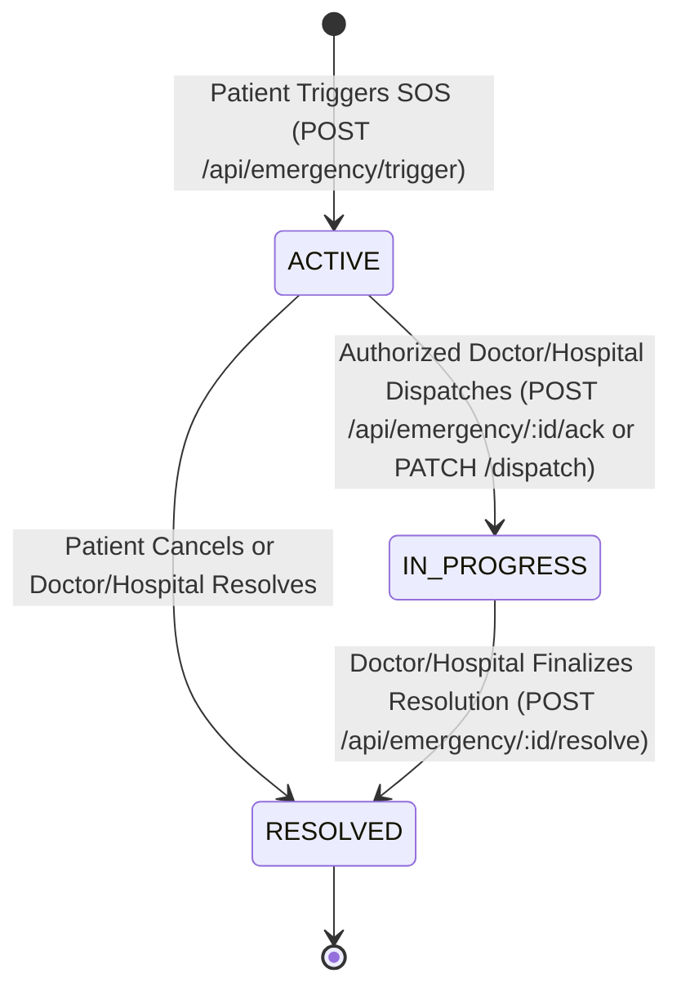

# MED-X Phase 1I — Cross-Role Emergency & SOS Workflow Integration

## 1. Phase Objective
The primary objective of Phase 1I is to integrate the existing Emergency and SOS functionality found across the authoritative source baselines (`source_baselines/doctor/`, `source_baselines/patient/`, and `source_baselines/hospital/`) into the unified Med-X architecture.

This connects the clinical and operational workflow across all four primary roles:
$$\text{Patient (SOS Alert)} \longrightarrow \text{Unified Backend} \longrightarrow \text{Doctor Clinical Desk} \longleftrightarrow \text{Hospital Monitoring Desk} \longrightarrow \text{Dispatch / Resolution}$$

Phase 1I strictly integrates existing functionality, preserving intended semantics while closing genuine cross-role gaps without inventing an ungrounded emergency product or external dispatch provider network.

---

## 2. Source Forensic Findings

| Role / Source Baseline | Forensic Findings & Code Footprint | Operational Semantics |
|---|---|---|
| **Doctor Workstation** (`source_baselines/doctor/`) | `models/EmergencyAlert.js`, `controllers/emergencyController.js`, `routes/emergencyRoutes.js`, `components/EmergencyView.jsx`, `RealGpsMapModal.jsx`. | Doctor workstation polled `GET /api/emergency`, displayed live active count badge, simulated audio alarm and test beep, filtered alerts by severity, displayed GPS coordinates modal, and provided acknowledge/dispatch actions (`DELETE /api/emergency/:id`, `PUT /api/emergency/:id/acknowledge`). |
| **Patient Portal** (`source_baselines/patient/`) | `models/EmergencySOS.js`, `routes/emergency.js`, `pages/patient/Dashboard.jsx`. | Patient portal featured an "Emergency SOS" button with confirmation prompt, triggering `POST /api/emergency/trigger` (or `POST /api/emergency`), writing to `EmergencySOS` collection with patientId, doctorId, hospitalId, and status (`open`, `acknowledged`, `resolved`). |
| **Hospital Operations** (`source_baselines/hospital/` & `source_baselines/patient/src/pages/hospital/`) | `HospitalCriticalAlerts.jsx`, `HospitalDashboard.jsx`, `HospitalProfile.jsx`. | Hospital operations featured 24/7 Level 1 Emergency configuration, monitoring live emergency alerts at `GET /api/emergency`, with capability to acknowledge (`POST /api/emergency/:id/ack`) and resolve (`POST /api/emergency/:id/resolve`) critical incidents. |
| **Laboratory Workspace** (`source_baselines/patient/` & `source_baselines/hospital/`) | No Emergency/SOS operational privileges or models. | Confirmed boundary: Laboratory staff are diagnostics personnel and have **zero** operational or administrative privileges over emergency dispatch. |

---

## 3. Source-to-Target Migration Map

| Source Component | Legacy Route / File | Canonical Unified Target | Description |
|---|---|---|---|
| Patient SOS Trigger | `POST /api/emergency/trigger` (`patient/routes/emergency.js`) | `POST /api/emergency/trigger` & `POST /api/emergency` | Patient triggers alert; derives patient identity from `req.user._id`, captures GPS coordinates, links hospital/doctor. |
| Doctor Emergency Polling | `GET /api/emergency` (`doctor/backend/controllers/emergencyController.js`) | `GET /api/emergency` | Role-scoped query: Doctor sees alerts assigned to them, hospital-affiliated alerts, and open triage alerts. |
| Hospital Alert Monitoring | `GET /api/emergency` (`patient/src/pages/hospital/HospitalCriticalAlerts.jsx`) | `GET /api/emergency` | Tenant-isolated query: Hospital Admin sees strictly alerts affiliated with their facility (`hospitalId`). |
| Response Acknowledge / Dispatch | `POST /api/emergency/:id/ack`, `PATCH /api/emergency/:id/dispatch` | `POST /api/emergency/:id/ack`, `PATCH /api/emergency/:id/dispatch` | Server-controlled transition from `ACTIVE` $\rightarrow$ `IN_PROGRESS` with clinical dispatch notes. |
| Incident Resolution | `POST /api/emergency/:id/resolve` | `POST /api/emergency/:id/resolve` | Server-controlled transition from `ACTIVE` or `IN_PROGRESS` $\rightarrow$ `RESOLVED`. |
| Patient Dashboard SOS Button | `source_baselines/patient/src/pages/patient/Dashboard.jsx` | `client/src/pages/patient/PatientDashboard.jsx` | Geolocation capture, confirmation modal, active emergency status banner, cancellation. |
| Doctor Emergency Desk | `source_baselines/doctor/src/components/EmergencyView.jsx` | `client/src/pages/doctor/DoctorEmergency.jsx` & `DoctorWorkspace.jsx` | 5-second polling, simulated audio alarm, patient dossier review, GPS radar, dispatch modal. |
| Hospital Monitoring Desk | `HospitalCriticalAlerts.jsx` | `client/src/pages/hospital/HospitalEmergency.jsx` & `HospitalWorkspace.jsx` | 5-second polling, emergency incident stream, rapid response squad dispatch, resolution. |

---

## 4. Canonical EmergencyAlert Data Model

The unified architecture implements a **single canonical `EmergencyAlert` model** (`server/src/models/EmergencyAlert.js`) in MongoDB:

```javascript
EmergencyAlert Schema:
├── alertId: String (unique, human-readable e.g. "EMG-4821", indexed)
├── patientId: ObjectId ref 'User' (required, indexed)
├── patientProfileId: ObjectId ref 'Patient' (indexed)
├── patientName: String (required)
├── age: Number
├── gender: String
├── bloodGroup: String
├── phone: String
├── doctorId: ObjectId ref 'Doctor' (default null, indexed)
├── hospitalId: ObjectId ref 'Hospital' (default null, indexed)
├── status: String ['ACTIVE', 'IN_PROGRESS', 'RESOLVED'] (default: 'ACTIVE', indexed)
├── alertType: String (default: 'Emergency SOS Distress Signal')
├── triggerReason: String
├── vitalsAtAlert: String
├── vitalSeverity: String (default: 'Critical High Risk')
├── location:
│   ├── latitude: Number (-90 to 90)
│   ├── longitude: Number (-180 to 180)
│   ├── address: String
│   └── coordinatesText: String (e.g. "28.6139° N, 77.2090° E")
├── dispatch:
│   ├── dispatchedAt: Date
│   ├── dispatchedBy: ObjectId ref 'User'
│   ├── statusText: String (e.g. "Rapid Response Squad Dispatched")
│   └── dispatchNotes: String
├── acknowledgedAt: Date
├── acknowledgedBy: ObjectId ref 'User'
├── resolvedAt: Date
├── resolvedBy: ObjectId ref 'User'
├── resolutionNotes: String
└── timestamps: createdAt, updatedAt
```

---

## 5. Emergency State Machine

All state transitions are strictly controlled on the server:



- **Rejection of Invalid Transitions**:
  - Acknowledging or dispatching an already `RESOLVED` alert returns `400 Bad Request` (`INVALID_STATE_TRANSITION`).
  - Attempting to re-resolve an already resolved alert returns `400 Bad Request` (`ALREADY_RESOLVED`).
  - Frontend cannot directly set arbitrary status values; transitions require deliberate endpoint invocation.

---

## 6. Role Workflows

### Patient Workflow
1. Patient encounters physiological distress and clicks **"Emergency SOS"** on their dashboard.
2. The browser presents a deliberate confirmation prompt (`window.confirm`) to prevent accidental clicks.
3. The browser attempts geolocation capture via `navigator.geolocation.getCurrentPosition`.
4. The alert is transmitted to `POST /api/emergency/trigger` using the unified JWT.
5. Patient dashboard displays a persistent **Active Emergency SOS Banner** showing the alert ID, severity, coordinates, and real-time clinical notes.
6. When clinical staff acknowledge/dispatch, the banner automatically updates to **"IN PROGRESS / DISPATCHED"**.
7. Patient can cancel or mark the alert resolved if the emergency clears.

### Doctor Workflow
1. Doctor workspace displays an **Emergency SOS Desk** tab and an **Emergency Alerts** metric card with a live active counter.
2. The workstation polls `GET /api/emergency` approximately every 5 seconds.
3. If active alerts are detected, the audio siren toggle and visual pulse indicators activate.
4. Clinician can inspect patient details, review recorded vitals, view the **GPS Radar** modal, and initiate a **Simulated Audio Call**.
5. Clinician clicks **"Acknowledge & Dispatch"**, selects an operational preset (e.g., *Rapid Response Squad Dispatched*, *Physician Attending in ER Bay*), enters dispatch directives, and confirms. The alert transitions to `IN_PROGRESS`.
6. Once the patient is stabilized, clinician clicks **"Mark Resolved"** to record clinical notes.

### Hospital Operations Workflow
1. Hospital Admin workspace features a dedicated **Critical Alerts & SOS Desk** tab.
2. Alerts are polled every 5 seconds, strictly filtered by `hospitalId` (facility isolation).
3. Operations staff can review incident telemetry, patient emergency contacts, and dispatch hospital response squads.
4. Hospital Admin can record institutional resolution documentation upon emergency clearance.

---

## 7. Authentication, RBAC & Cross-Tenant Security

- **Unified JWT Authentication**: All emergency endpoints require valid `Bearer` token verified via `requireAuth`.
- **Identity Derivation**: `patientId` is resolved server-side from `req.user._id`. Frontend-supplied `patientId` is validated against `req.user._id`; any mismatch is rejected with `403 IDOR_VIOLATION`.
- **Doctor Scoping**: Doctors can only access alerts assigned to them, alerts affiliated with their hospital, or unassigned active alerts awaiting triage.
- **Hospital Isolation**: Hospital Admin visibility is strictly restricted to alerts where `alert.hospitalId === req.user.hospitalId`. Cross-hospital lookups return `403 FORBIDDEN`.
- **Laboratory Exclusion**: Laboratory administrators have no operational emergency desk privileges. Endpoints reject laboratory requests with `403 FORBIDDEN`.

---

## 8. Real vs. Simulated vs. Deferred Classification

| Capability | Classification | Technical Description |
|---|---|---|
| **Emergency SOS Persistence** | **REAL / PERSISTED** | Persisted directly in real MongoDB (`medx_unified` / `medx_unified_test`) via Mongoose `EmergencyAlert` model. |
| **GPS Location Capture** | **REAL** | Captured from browser/device `navigator.geolocation.getCurrentPosition`, validated (-90..90, -180..180), and persisted. |
| **GPS Radar Visualization** | **REAL / LOCAL** | Visual radar crosshair display rendering actual latitude/longitude coordinates; Leaflet external map server dependencies avoided. |
| **Cross-Role Polling** | **REAL / POLLING** | Standard HTTP polling cadence (~5s) via `setInterval` / `clearInterval` in React components; no WebSockets or Socket.IO. |
| **Emergency Audio Alarm** | **SIMULATED** | Synthesized alarm audio generated locally using the HTML5 Web Audio API (`OscillatorNode` / `GainNode`); no external audio files or telephony. |
| **Doctor Phone Call** | **SIMULATED** | Simulated consultation call modal per Phase 1F contract; WebRTC is deferred. |
| **Rapid Response Dispatch** | **REAL / STATE TRANSITION** | Server-side state machine transition (`ACTIVE` $\rightarrow$ `IN_PROGRESS`) with persisted dispatch timestamps and directives. |
| **External Ambulance Network** | **DEFERRED** | Real-world emergency dispatch integration (e.g. 911/108 CAD systems, Twilio telephony, external fleet management) is strictly out of scope. |

---

## 9. Domain Boundaries

1. **EmergencyAlert vs. MedicalReport**:
   - An `EmergencyAlert` is an acute operational distress broadcast.
   - It does **NOT** automatically create a `MedicalReport` or trigger biomarker extraction.
   - Both collections remain completely distinct.

2. **EmergencyAlert vs. CareQueue**:
   - Institutional CareQueue tasks represent admitted inpatient care items managed across the 6-stage operational pipeline (`Triaged`, `Bed Assigned`, `Doctor Assigned`, `Diagnostics Ordered`, `Treatment Active`, `Discharged`).
   - Emergency alerts do **NOT** automatically inject tasks into the CareQueue unless an explicit inpatient admission workflow is initiated.
   - Outpatient SOS alerts remain self-contained in the emergency operational stream.

---

## 10. Automated Verification Results

### Test Suite Execution
- Suite: `server/tests/emergency.test.js`
- Test Framework: Node.js native test runner (`node:test`)
- Database: Real MongoDB (`medx_unified_test`)

### Regression Baseline
| Suite | Tests | Result |
|---|---|---|
| **Phase 1D** — Unified Foundation Suite | 15 / 15 | **PASS** |
| **Phase 1E** — Patient Diagnostics, Reports & ML Suite | 12 / 12 | **PASS** |
| **Phase 1F** — Doctor Workstation & Prescriptions Suite | 14 / 14 | **PASS** |
| **Phase 1G** — Hospital Operations, Beds & CareQueue Suite | 17 / 17 | **PASS** |
| **Phase 1H** — Laboratory Management & Diagnostics Suite | 32 / 32 | **PASS** |
| **Phase 1I** — Cross-Role Emergency & SOS Integration Suite | 35 / 35 | **PASS** |
| **TOTAL REGRESSION BASELINE** | **125 / 125** | **100% PASS** |

### Frontend Production Build
- Command: `npm run build` in `client/`
- Tool: `vite v6.4.3`
- Result: **PASS** (Built in 13.88s, zero errors).

---

## 11. Source Immutability Audit
- `source_baselines/login/`: **UNCHANGED**
- `source_baselines/patient/`: **UNCHANGED**
- `source_baselines/doctor/`: **UNCHANGED**
- `source_baselines/hospital/`: **UNCHANGED**
- Original 4 repositories (`Login Page/Med-X`, `Patient Page/Medx-jankoti`, `Doctor Page/DoctorPage3`, `Hospital Page/hospital-page`): **UNCHANGED**.

---

## 12. Known Limitations & Phase 1J Readiness
- **Polling Cadence**: Synchronized via 5-second interval polling rather than WebSockets. This aligns strictly with the Phase 1C contract and avoids ungrounded real-time infrastructure complexity.
- **Audio Consultation**: Doctor-patient voice consultation remains simulated; WebRTC and production telephony are deferred.
- **Phase 1J Readiness**: **READY** for Phase 1J (Final System Hardening & Cross-Role Release Verification).
